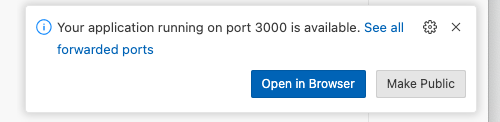

# Elements Interactive

This project is a simple example of how to pair [Hypar Elements](https://github.com/hypar-io/Elements) with a web front end using React + React-Three-Fiber.

## Server
The Server is a dotnet 8 ASP.net Minimal API that serves up a `/model` endpoint that returns a Hypar Model.

## Client
The Client is a Next.JS React app that uses [React-Three-Fiber](https://docs.pmnd.rs/react-three-fiber/getting-started/introduction) to render the model returned from the server, and [Leva](https://github.com/pmndrs/leva) to consume the inputs / parameters to drive model creation.

## How to start:
- First, open a codespace from this repository.  Use the green "Code" button, go to the Codespaces tab, and choose "Create codespace on main."

- If you're just opening the codespace for the first time, give it a minute to get everything loaded / installed.
- Use the VS Code Command Palette (cmd/ctrl + shift + p) to "Run Task". Choose the "Start Client and Server" option.
- When you see the message "Your application running on port 3000 is available", click the "Open In Browser" button.
